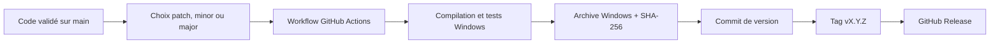
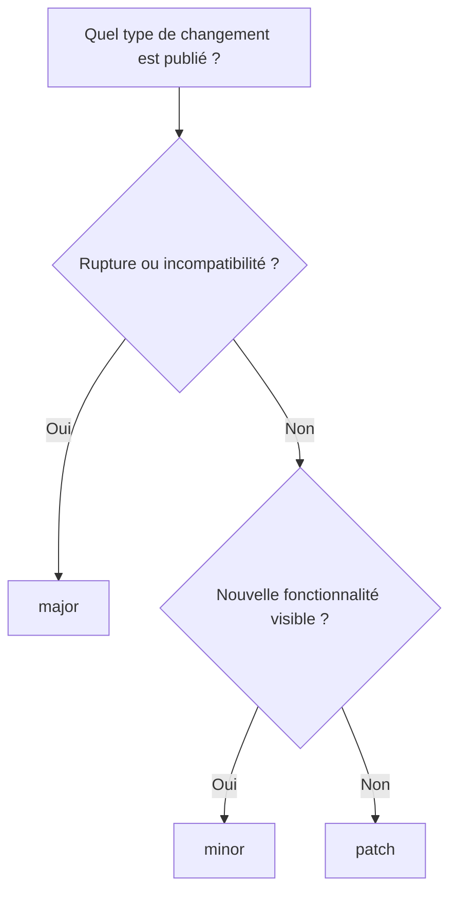
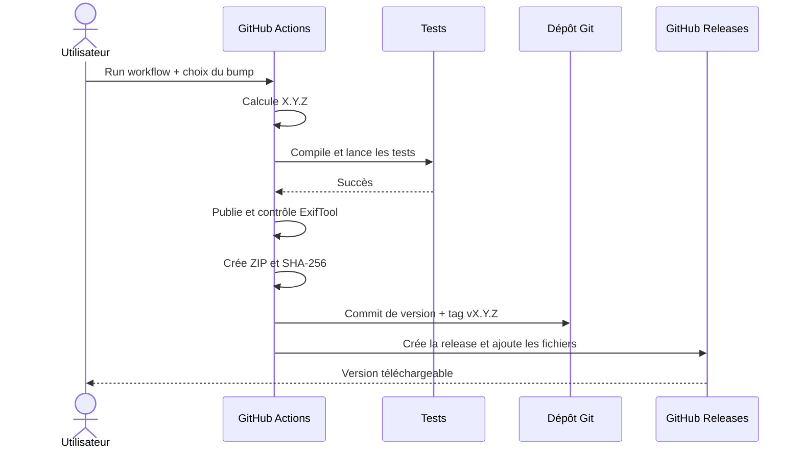
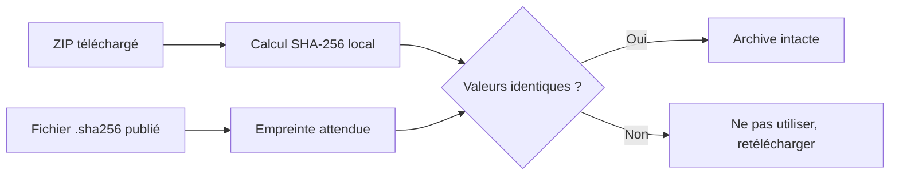
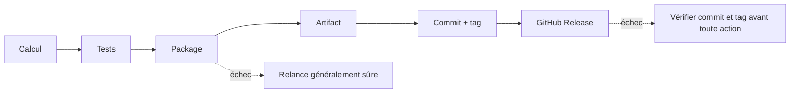
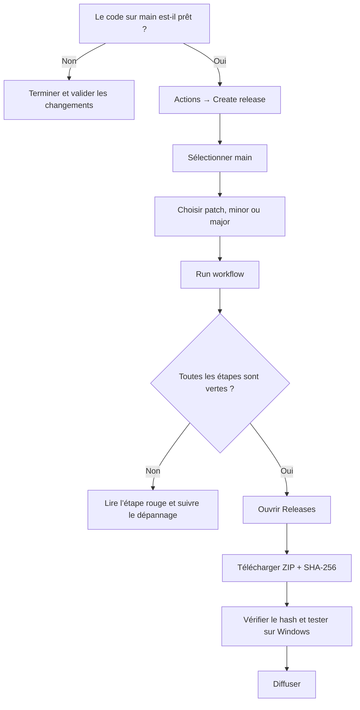

# Guide complet de création d’une release ExifTweaker

> Guide destiné à une personne qui découvre GitHub, GitHub Actions et le processus de publication du projet.

## 1. Objectif du guide

Ce document explique comment :

1. choisir correctement un numéro de version ;
2. lancer le workflow de release depuis l’interface GitHub ;
3. suivre la compilation et les tests ;
4. reconnaître une release réussie ;
5. télécharger et vérifier le programme compilé ;
6. diagnostiquer un échec sans aggraver la situation.

Le dépôt concerné est : [fatvicbart/exif-tweaker](https://github.com/fatvicbart/exif-tweaker).

Le workflow utilisé est **Create release**, défini dans `.github/workflows/release.yml`.

---

## 2. Ce qu’est une release

Une release est une version identifiée et téléchargeable de l’application. Elle associe :

- un numéro de version, par exemple `2.0.1` ;
- un tag Git immuable, par exemple `v2.0.1` ;
- le code source correspondant exactement à cette version ;
- une archive contenant l’application Windows compilée ;
- un fichier SHA-256 permettant de vérifier l’intégrité de l’archive ;
- des notes générées automatiquement à partir des changements Git.

### Schéma général



Une release ne doit être lancée que lorsque le contenu actuel de `main` est prêt à être distribué.

---

## 3. Conditions nécessaires

Avant de commencer, vérifier les points suivants.

| Condition | Pourquoi | Comment vérifier |
|---|---|---|
| Être connecté à GitHub | L’interface Actions n’est pas utilisable anonymement | L’avatar du compte apparaît en haut à droite |
| Avoir un accès en écriture au dépôt | GitHub exige cet accès pour lancer manuellement le workflow | Le bouton **Run workflow** est visible |
| Utiliser la branche `main` | Le job de release refuse volontairement une autre branche | Le sélecteur de branche indique `main` |
| Avoir terminé et poussé les changements | La release compile ce qui se trouve sur GitHub, pas les fichiers locaux non poussés | Le dernier commit attendu apparaît dans l’onglet **Code** |
| Ne pas avoir une autre release en cours | Deux publications simultanées pourraient se concurrencer | Aucun run **Create release** n’est en cours |
| Avoir une validation normale verte | Cela réduit le risque de découvrir un défaut pendant la publication | Le workflow **Validate build** du dernier commit est vert |

> Le workflow possède la permission `contents: write`, nécessaire pour pousser le commit de version, créer le tag et publier la release. Une règle de protection de branche ou une politique d’organisation peut néanmoins interdire cette écriture.

---

## 4. Comprendre `patch`, `minor` et `major`

ExifTweaker utilise une version composée de trois nombres :

```text
MAJOR.MINOR.PATCH
  2  .  0  .  1
```

| Choix | Quand l’utiliser | Exemple depuis `2.0.0` |
|---|---|---:|
| `patch` | Correction de bug, amélioration interne ou petite modification compatible | `2.0.1` |
| `minor` | Nouvelle fonctionnalité compatible avec l’utilisation actuelle | `2.1.0` |
| `major` | Changement important ou incompatible, rupture d’usage ou de format | `3.0.0` |

### Arbre de décision



En cas de doute entre `patch` et `minor` :

- choisir `patch` si le comportement existant est seulement corrigé ;
- choisir `minor` si l’utilisateur obtient une nouvelle capacité.

### Version initiale du dépôt

La version inscrite actuellement dans le projet est `2.0.0`. Le premier lancement avec `patch` produira donc `2.0.1`.

Le workflow lit toujours la version courante dans `ExifTweaker/ExifTweaker.csproj`. Il ne se base pas sur une valeur saisie manuellement.

---

## 5. Procédure rapide

Pour une publication standard :

1. ouvrir <https://github.com/fatvicbart/exif-tweaker> ;
2. cliquer sur **Actions** ;
3. cliquer sur **Create release** dans la colonne de gauche ;
4. cliquer sur **Run workflow** ;
5. conserver la branche **main** ;
6. sélectionner `patch`, `minor` ou `major` ;
7. cliquer sur le bouton vert **Run workflow** ;
8. ouvrir le nouveau run et attendre que **Build, test and release** devienne vert ;
9. ouvrir la page **Releases** et télécharger l’archive `ExifTweaker-X.Y.Z-win-x64.zip`.

Ne pas lancer une seconde fois le workflow simplement parce que le nouveau run met quelques secondes à apparaître.

---

## 6. Procédure détaillée dans l’interface GitHub

### Étape 1 — Ouvrir le dépôt

Ouvrir la page principale :

<https://github.com/fatvicbart/exif-tweaker>

Repérer la barre d’onglets située sous le nom du dépôt.

```text
┌────────────────────────────────────────────────────────────────────┐
│ fatvicbart / exif-tweaker                                         │
├────────────────────────────────────────────────────────────────────┤
│ [Code]  [Issues]  [Pull requests]  [Actions]  [Projects] ...      │
└────────────────────────────────────────────────────────────────────┘
                                      ↑
                              cliquer sur Actions
```

### Étape 2 — Ouvrir le workflow de release

Dans l’onglet **Actions**, la colonne de gauche contient la liste des workflows.

```text
┌──────────────────────┬─────────────────────────────────────────────┐
│ Actions              │ All workflows                               │
│                      │                                             │
│ All workflows        │                                             │
│ Validate build       │                                             │
│ Create release  ◀────┼── sélectionner ce workflow                  │
└──────────────────────┴─────────────────────────────────────────────┘
```

Cliquer sur **Create release**. Ne pas choisir **Validate build** : celui-ci valide les commits mais ne crée pas de version téléchargeable.

### Étape 3 — Ouvrir le formulaire

En haut à droite de la liste des exécutions, cliquer sur **Run workflow**.

```text
┌────────────────────────────────────────────────────────────────────┐
│ Create release                                  [Run workflow ▼]  │
│                                                    ↑               │
│                                      ouvrir le formulaire          │
└────────────────────────────────────────────────────────────────────┘
```

Si ce bouton n’apparaît pas, consulter la section [Dépannage](#13-dépannage).

### Étape 4 — Remplir le formulaire

Le formulaire contient deux choix.

```text
┌──────────────────────────────────────────────┐
│ Run workflow                                │
│                                             │
│ Use workflow from:  [Branch: main       ▼] │
│ Version increment:  [patch              ▼] │
│                                             │
│                         [Run workflow]      │
└──────────────────────────────────────────────┘
```

1. Dans **Use workflow from**, sélectionner impérativement `main`.
2. Dans **Version increment**, sélectionner le niveau souhaité.
3. Relire le choix avant de confirmer.
4. Cliquer sur le bouton vert **Run workflow**.

> Le sélecteur de branche indique la version du fichier de workflow à exécuter. Le job lui-même est limité à `main` ; une autre branche produirait un run ignoré.

### Étape 5 — Ouvrir le nouveau run

Le run peut mettre quelques secondes à apparaître. Actualiser une seule fois la page si nécessaire.

Le nom du run apparaît avec un indicateur :

| Icône/couleur | Signification | Action |
|---|---|---|
| Jaune/orange | En attente ou en cours | Attendre |
| Vert | Réussi | Contrôler puis télécharger la release |
| Rouge | Échec | Ouvrir l’étape rouge et lire son erreur |
| Gris | Annulé ou ignoré | Vérifier la branche et la raison indiquée |

Cliquer sur le run, puis sur le job **Build, test and release** pour voir le détail.

---

## 7. Ce que fait automatiquement le workflow



| Ordre | Étape affichée | Rôle | Résultat attendu |
|---:|---|---|---|
| 1 | **Check out repository** | Télécharge tout l’historique et les tags | Étape verte |
| 2 | **Set up .NET** | Installe le SDK .NET 10 sur le runner Windows | Étape verte |
| 3 | **Calculate and apply version** | Lit la version, applique le bump et prépare le tag | Nouvelle version dans les logs |
| 4 | **Restore** | Télécharge les dépendances NuGet | Restauration réussie |
| 5 | **Build and test** | Compile la solution et exécute tous les tests, y compris ExifTool sous Windows | Aucun test en échec |
| 6 | **Publish Windows application** | Produit l’application `win-x64` | Publication réussie |
| 7 | **Validate and package release** | Vérifie ExifTweaker, ExifTool et Perl, exécute `exiftool -ver`, crée ZIP et SHA-256 | Trois fichiers requis présents |
| 8 | **Upload workflow artifact** | Conserve une copie du livrable dans le run Actions | Artifact visible |
| 9 | **Commit version and create tag** | Commit la version puis pousse atomiquement le commit et le tag | Commit `Release vX.Y.Z` et tag créés |
| 10 | **Create GitHub release** | Crée la page publique de release et ses notes | Release visible dans **Releases** |

Si une étape échoue, les étapes suivantes ne sont pas exécutées.

---

## 8. Reconnaître une release réussie

Une publication est terminée seulement lorsque les quatre conditions suivantes sont réunies :

- le job **Build, test and release** est vert ;
- un commit nommé `Release vX.Y.Z` apparaît sur `main` ;
- le tag `vX.Y.Z` existe ;
- une page `ExifTweaker vX.Y.Z` apparaît dans **Releases** avec deux fichiers joints.

### Livrables attendus

| Fichier | Utilité |
|---|---|
| `ExifTweaker-X.Y.Z-win-x64.zip` | Application Windows compilée à distribuer |
| `ExifTweaker-X.Y.Z-win-x64.zip.sha256` | Empreinte permettant de vérifier que le ZIP est intact |

GitHub ajoute également **Source code (zip)** et **Source code (tar.gz)**. Ces deux archives contiennent le code source, pas l’application prête à lancer.

```text
Assets
├── ExifTweaker-X.Y.Z-win-x64.zip          ← application
├── ExifTweaker-X.Y.Z-win-x64.zip.sha256   ← contrôle d’intégrité
├── Source code (zip)                      ← ne pas confondre
└── Source code (tar.gz)                   ← ne pas confondre
```

---

## 9. Télécharger le résultat

### Depuis la page Releases — méthode recommandée

1. revenir à la page principale du dépôt ;
2. cliquer sur **Releases** dans la colonne de droite, ou ouvrir <https://github.com/fatvicbart/exif-tweaker/releases> ;
3. ouvrir la release souhaitée ;
4. développer **Assets** si nécessaire ;
5. télécharger `ExifTweaker-X.Y.Z-win-x64.zip` ;
6. télécharger aussi le fichier `.sha256`.

### Depuis le run Actions — copie temporaire

Le résumé du run contient une section **Artifacts**. L’artifact nommé `ExifTweaker-X.Y.Z-win-x64` contient le ZIP et son empreinte.

Cette copie est principalement destinée au diagnostic. Pour distribuer le programme, préférer les fichiers de la page **Releases**, qui sont associés durablement au tag.

---

## 10. Vérifier l’intégrité de l’archive

Placer le ZIP et le fichier `.sha256` dans le même dossier.

Dans PowerShell, ouvrir ce dossier puis exécuter :

```powershell
Get-FileHash .\ExifTweaker-X.Y.Z-win-x64.zip -Algorithm SHA256
Get-Content .\ExifTweaker-X.Y.Z-win-x64.zip.sha256
```

Les deux longues valeurs hexadécimales doivent être identiques, sans tenir compte des majuscules/minuscules.



Si les valeurs diffèrent, supprimer le ZIP et le télécharger à nouveau. Ne pas exécuter son contenu.

---

## 11. Tester le livrable avant diffusion

Effectuer ce contrôle sur une machine Windows de test.

1. extraire entièrement le ZIP dans un nouveau dossier ;
2. ne pas déplacer seulement `ExifTweaker.exe` ;
3. vérifier que le sous-dossier `exiftool` est toujours présent à côté de l’application ;
4. vérifier que le **.NET 10 Desktop Runtime** est installé ;
5. lancer `ExifTweaker.exe` ;
6. importer une copie de média de test, jamais l’unique original ;
7. lire ses métadonnées ;
8. préparer une modification simple ;
9. contrôler l’aperçu avant application ;
10. appliquer la modification ;
11. relire la métadonnée ;
12. vérifier la sauvegarde originale et la restauration.

Arborescence minimale attendue après extraction :

```text
ExifTweaker-X.Y.Z-win-x64/
├── ExifTweaker.exe
├── ExifTweaker.dll
├── autres dépendances .NET
└── exiftool/
    ├── exiftool.exe
    └── exiftool_files/
        ├── perl.exe
        └── autres fichiers ExifTool
```

Le package est actuellement **framework-dependent** : il n’embarque pas tout le runtime .NET. La machine cible doit donc disposer du runtime compatible.

---

## 12. Contrôle après publication

Utiliser cette checklist après chaque release :

- [ ] le run **Create release** est vert ;
- [ ] le nombre total de tests est cohérent et aucun test n’a échoué ;
- [ ] le commit `Release vX.Y.Z` est sur `main` ;
- [ ] le tag `vX.Y.Z` pointe sur ce commit ;
- [ ] la release `ExifTweaker vX.Y.Z` est visible ;
- [ ] le ZIP Windows est présent dans **Assets** ;
- [ ] le fichier SHA-256 est présent ;
- [ ] l’empreinte locale correspond ;
- [ ] l’application démarre sur une machine Windows de test ;
- [ ] ExifTool est détecté ;
- [ ] un test lecture/modification/restauration sur une copie de média réussit.

Ne communiquer la release aux utilisateurs qu’après cette checklist.

---

## 13. Dépannage

### Le bouton `Run workflow` n’apparaît pas

Causes fréquentes :

- le compte n’est pas connecté ;
- le compte n’a pas l’accès en écriture ;
- **Create release** n’est pas le workflow sélectionné ;
- le workflow n’est pas présent sur la branche par défaut ;
- GitHub Actions est désactivé pour le dépôt.

Actions :

1. vérifier le compte connecté ;
2. rouvrir **Actions → Create release** ;
3. vérifier que `.github/workflows/release.yml` existe sur `main` ;
4. vérifier les réglages **Settings → Actions → General**.

### Le run est gris ou le job est ignoré

La branche choisie n’est probablement pas `main`. Relancer depuis le workflow en sélectionnant `main`.

### `Calculate and apply version` échoue

| Message probable | Cause | Action |
|---|---|---|
| `No semantic <Version> was found` | La propriété `<Version>X.Y.Z</Version>` manque ou a un format incorrect | Corriger le `.csproj`, valider puis relancer |
| `Tag vX.Y.Z already exists` | La version calculée possède déjà un tag | Examiner les tags et la dernière version ; ne pas supprimer le tag sans analyse |
| `Unsupported version increment` | Valeur de bump invalide | Relancer avec `patch`, `minor` ou `major` |

### `Restore` ou `Publish Windows application` échoue

Causes possibles :

- indisponibilité temporaire de NuGet ou de GitHub ;
- dépendance incompatible ;
- erreur de compilation ;
- espace disque insuffisant sur le runner.

Ouvrir l’étape rouge et lire les dernières lignes. Si l’erreur est clairement réseau et temporaire, un nouveau lancement peut être tenté.

### `Build and test` échoue

Ne pas publier. Cliquer sur l’étape et relever :

- le nom exact du test en échec ;
- le message `expected` / `actual` ;
- la pile d’appel ;
- les sections **Standard output**, **Debug Trace** et **Error output**.

Corriger le code ou le test sur une branche de travail, faire valider le correctif, le fusionner dans `main`, puis lancer une nouvelle release.

### `Validate and package release` échoue

Le package est incomplet ou ExifTool ne démarre pas. Vérifier en priorité :

- `ExifTweaker.exe` ;
- `exiftool/exiftool.exe` ;
- `exiftool/exiftool_files/perl.exe` ;
- la sortie de `exiftool -ver`.

Ne pas contourner ce contrôle : une application sans la distribution ExifTool complète ne fonctionnerait pas correctement.

### `Commit version and create tag` échoue avec 403 ou une protection de branche

Le jeton GitHub Actions ne peut pas pousser sur `main`.

Vérifier :

1. **Settings → Actions → General → Workflow permissions** ;
2. les règles de protection ou rulesets appliqués à `main` ;
3. si `github-actions[bot]` est autorisé à pousser ;
4. si une autre modification a été poussée sur `main` pendant le workflow.

Le push du commit et du tag utilise `--atomic` : Git doit publier les deux ensemble ou aucun des deux.

### `Create GitHub release` échoue

Cette étape arrive après la création du commit et du tag. Avant de relancer quoi que ce soit :

1. vérifier si le commit `Release vX.Y.Z` existe ;
2. vérifier si le tag `vX.Y.Z` existe ;
3. vérifier si la page de release existe malgré le message d’erreur.

Si le commit et le tag existent mais pas la release, ne pas relancer aveuglément le workflow : il calculerait la version suivante. Créer ou réparer la release à partir du tag existant et joindre les bons fichiers, ou corriger le workflow avec une procédure contrôlée.

### L’artifact Actions existe mais aucune release n’apparaît

Cela indique généralement que l’échec est survenu après **Upload workflow artifact**. Télécharger l’artifact pour le conserver, puis examiner les étapes de commit, tag et création de release.

### Avertissement Microsoft `WindowsBase`

Un avertissement de résolution d’assembly n’est pas automatiquement un échec. Le critère est le code de sortie final et l’état vert ou rouge de l’étape. Il doit néanmoins être suivi si une future mise à jour de WebView2 ou .NET provoque un comportement anormal.

---

## 14. Quand peut-on relancer un workflow ?

| Situation | Relance directe conseillée ? | Pourquoi |
|---|---:|---|
| Échec avant le commit/tag | Oui, après correction ou incident temporaire confirmé | Aucun numéro de version n’a normalement été publié |
| Run annulé avant le commit/tag | Oui | Aucun état Git distant ne devrait avoir changé |
| Échec pendant le push atomique | Vérifier d’abord le dépôt | Le push peut avoir été refusé entièrement, mais il faut le confirmer |
| Échec après création du tag | Non | Une relance produirait potentiellement une autre version |
| Run entièrement vert | Non | Une release existe déjà ; relancer créerait volontairement la version suivante |

### Frontière importante



---

## 15. Annuler ou corriger une mauvaise release

Une release publiée correspond à un historique Git. Sa suppression n’efface pas automatiquement le commit, le tag ou les téléchargements déjà effectués.

Approche recommandée :

1. arrêter la diffusion ;
2. identifier précisément le problème ;
3. corriger le code sur une branche ;
4. valider et fusionner le correctif ;
5. publier une nouvelle version `patch` ;
6. marquer l’ancienne release comme dépréciée dans ses notes si nécessaire.

Ne pas supprimer ou déplacer un tag déjà distribué sauf décision explicite et comprise par tous les mainteneurs.

---

## 16. Utilisation facultative avec GitHub CLI

Cette méthode est destinée aux personnes déjà à l’aise avec un terminal. L’interface web reste la méthode recommandée pour débuter.

```bash
gh auth login
gh workflow run release.yml --ref main -f bump=patch
gh run watch
```

Pour voir les releases :

```bash
gh release list --repo fatvicbart/exif-tweaker
```

Pour télécharger les fichiers de la dernière release :

```bash
gh release download --repo fatvicbart/exif-tweaker
```

---

## 17. Résumé opérationnel



Règle simple : **vert ne signifie pas encore “diffusé”**. Une release n’est prête qu’après téléchargement, vérification SHA-256 et test fonctionnel du ZIP sur Windows.

---

## 18. Références

- [Lancer manuellement un workflow — documentation GitHub](https://docs.github.com/en/actions/how-tos/manage-workflow-runs/manually-run-a-workflow?tool=webui)
- [Consulter les logs d’un workflow — documentation GitHub](https://docs.github.com/en/actions/how-tos/monitor-workflows/use-workflow-run-logs)
- [Télécharger les artifacts d’un workflow — documentation GitHub](https://docs.github.com/en/actions/how-tos/manage-workflow-runs/download-workflow-artifacts)
- [Comprendre les GitHub Releases — documentation GitHub](https://docs.github.com/en/repositories/releasing-projects-on-github/about-releases)
- [Page des releases ExifTweaker](https://github.com/fatvicbart/exif-tweaker/releases)
