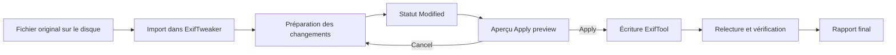
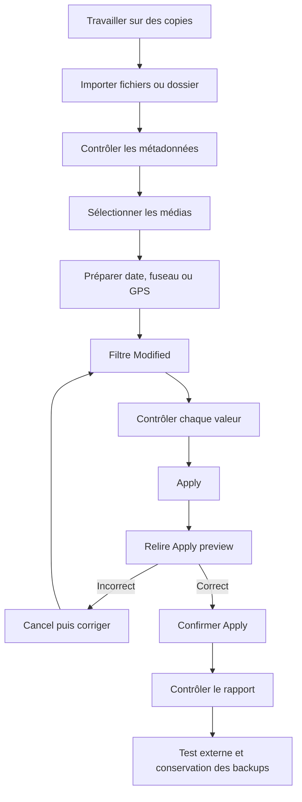

# ExifTweaker — Guide utilisateur complet

> Manuel de la version 2.0.1 pour une personne qui découvre le logiciel.

## 1. À quoi sert ExifTweaker ?

ExifTweaker est une application Windows permettant de consulter et de modifier en lot les métadonnées de photos et de vidéos.

Les fonctions principales sont :

- importer des fichiers ou des dossiers de médias ;
- consulter les dates, fuseaux horaires, coordonnées GPS, appareils et dimensions ;
- corriger une date ou décaler plusieurs dates ;
- ajouter, remplacer ou supprimer une position GPS ;
- rechercher un lieu et afficher les médias sur une carte ;
- préparer plusieurs modifications sans toucher immédiatement aux fichiers ;
- contrôler toutes les modifications dans un aperçu ;
- écrire les métadonnées avec ExifTool ;
- créer des sauvegardes originales et les restaurer.

ExifTweaker ne sert pas à modifier les pixels d’une image ni à monter une vidéo. Il modifie uniquement les métadonnées contenues dans les fichiers.

---

## 2. Principe essentiel : préparer, contrôler, appliquer

ExifTweaker fonctionne en deux temps.

1. Une action comme **PRÉPARER** ou **Date et heure** prépare une modification en mémoire.
2. Le bouton **Vérifier et appliquer tout (N)** ouvre le contrôle final puis écrit toutes les modifications en attente dans les fichiers.



> Tant que le bouton **Apply** de l’aperçu final n’a pas été confirmé, les métadonnées du fichier sur le disque ne sont pas modifiées.

Les commandes **Annuler**, **Rétablir**, **Réinitialiser la sélection** et **Réinitialiser toutes les modifications** agissent sur les changements préparés. Elles ne permettent pas d’annuler une écriture déjà appliquée. Après une écriture, utiliser **Restaurer une sauvegarde…** si une sauvegarde existe.

---

## 3. Configuration requise

### Système

- Windows 64 bits ;
- [.NET 10 Desktop Runtime x64](https://dotnet.microsoft.com/download/dotnet/10.0) ;
- Microsoft Edge WebView2 Runtime pour la carte ;
- une connexion Internet pour la carte et le géocodage ;
- aucune connexion Internet pour la lecture et l’écriture locale des métadonnées.

ExifTool est déjà intégré au package officiel. Il n’est normalement pas nécessaire de l’installer séparément.

### Conseils avant la première utilisation

- commencer avec des copies de quelques médias ;
- conserver la stratégie de sauvegarde par défaut ;
- vérifier l’espace disponible dans le dossier des médias ;
- ne pas travailler directement sur l’unique copie d’archives importantes ;
- attendre le rapport final avant de fermer l’application.

---

## 4. Installation et premier démarrage

1. Ouvrir la page [Releases](https://github.com/fatvicbart/exif-tweaker/releases).
2. Télécharger `ExifTweaker-X.Y.Z-win-x64.zip`.
3. Extraire entièrement le ZIP dans un dossier, par exemple `C:\Applications\ExifTweaker`.
4. Ne pas déplacer seulement `ExifTweaker.exe` : le dossier `exiftool` doit rester avec l’application.
5. Installer le .NET 10 Desktop Runtime x64 si Windows le demande.
6. Lancer `ExifTweaker.exe`.

Arborescence minimale attendue :

```text
ExifTweaker-X.Y.Z-win-x64/
├── ExifTweaker.exe
├── ExifTweaker.dll
├── autres dépendances
└── exiftool/
    ├── exiftool.exe
    └── exiftool_files/
        ├── perl.exe
        └── autres composants ExifTool
```

Si Windows SmartScreen affiche un avertissement, vérifier que l’archive provient bien de la page officielle du dépôt et que son empreinte SHA-256 correspond avant de choisir d’exécuter le programme.

---

## 5. Vue d’ensemble de la fenêtre principale

```text
┌──────────────────────────────────────────────────────────────────────────────┐
│ Fichier | Édition | Date et heure | Localisation | Affichage | Actions | Aide│
├──────────────────────────────────────────────────────────────────────────────┤
│ Ouvrir ▼ | Date et heure | Localisation ▼ | Carte | Annuler | Rétablir     │
│ Filtre : Tous (24/24) ▼                 Vérifier et appliquer tout (3)      │
├───────────────────────────────────────────┬──────────────────────────────────┤
│ Liste des médias                          │ Aperçu du média                  │
│ ✓ Preview FileName Date Timezone ...      │ ou carte avec les marqueurs      │
│ [ ] [img] photo01.jpg ...                 │                                  │
│ [ ] [img] video01.mp4 ...                 │                                  │
├────────────────┬─────────────────────────────────────────────────────────────┤
│ FICHIERS…      │ Date et heure                                                │
│ RECHERCHER     │ Recherche de lieu                                           │
│ PRÉPARER       │ Nom ou description du lieu                                  │
├────────────────┴─────────────────────────────────────────────────────────────┤
│ Barre de progression                                  Ready / Working…       │
└──────────────────────────────────────────────────────────────────────────────┘
```

La fenêtre est composée de six zones :

1. le menu principal regroupant toutes les fonctions ;
2. la barre d’accès rapide pour les actions fréquentes ;
3. la liste des médias à gauche ;
4. l’aperçu ou la carte à droite ;
5. le sélecteur de date, la recherche de lieu et l’adresse choisie en bas ;
6. la progression et l’état de l’opération.

### Menu principal complet

```text
Fichier
├── Ouvrir des fichiers…                 Ctrl+O
├── Ouvrir un dossier…
├── Retirer de la session                Suppr lorsque le tableau est actif
├── Restaurer une sauvegarde…
├── Paramètres…
└── Quitter                              Alt+F4

Édition
├── Annuler                              Ctrl+Z
├── Rétablir                             Ctrl+Y
├── Réinitialiser la sélection
├── Réinitialiser toutes les modifications
└── Tout sélectionner                    Ctrl+A

Date et heure
├── Ouvrir l’éditeur complet…
├── Reculer d’une heure
├── Avancer d’une heure
├── Reculer d’une minute
└── Avancer d’une minute

Localisation
├── Rechercher un lieu…
├── Copier le GPS
├── Coller le GPS
├── Préparer la suppression du GPS
└── Identifier les coordonnées

Affichage
├── Afficher l’aperçu
├── Afficher la carte
└── Filtrer
    ├── Tous
    ├── Modifiés
    ├── Sans GPS
    ├── Sans date
    └── Erreurs

Actions
├── Vérifier et appliquer tout (N)
└── Annuler l’opération

Aide
├── Guide utilisateur                    F1
├── Ouvrir le dossier des journaux
├── Vérifier ExifTool
└── À propos d’ExifTweaker
```

### Barre d’accès rapide

| Commande | Rôle |
|---|---|
| `Ouvrir ▼` | Ouvrir des fichiers ou un dossier |
| `Date et heure` | Ouvrir l’éditeur complet pour la sélection |
| `Localisation ▼` | Accéder aux recherches et actions GPS |
| `Carte` | Basculer entre aperçu et carte |
| `Annuler` / `Rétablir` | Parcourir l’historique des changements préparés |
| `Filtre : Tous (X/Y) ▼` | Choisir un filtre et voir le nombre affiché sur le total |
| `Vérifier et appliquer tout (N)` | Contrôler puis écrire les N médias modifiés de toute la session |
| `Annuler l’opération` | Interrompre une opération longue ; actif uniquement pendant celle-ci |

> Le mot « tout » est important : l’application traite tous les changements en attente de la session, pas uniquement la sélection ou les lignes visibles.

Le titre de la fenêtre résume la session :

```text
ExifTweaker — 24 media | 18 GPS | 3 pending | 2023-07-01 to 2023-07-12
```

| Information | Signification |
|---|---|
| `24 media` | Nombre total de médias importés dans la session |
| `18 GPS` | Nombre de médias possédant une latitude et une longitude effectives |
| `3 pending` | Nombre de fichiers avec au moins une modification préparée |
| plage de dates | Première et dernière dates effectives de la session |

---

## 6. Comprendre la sélection

La plupart des commandes agissent sur les médias sélectionnés.

Un média est considéré comme sélectionné s’il remplit au moins une condition :

- sa ligne est sélectionnée dans le tableau ;
- sa case dans la colonne `✓` est cochée.

### Méthodes de sélection

| Action | Résultat |
|---|---|
| Cliquer sur une ligne | Sélectionne la ligne et affiche son aperçu |
| `Ctrl` + clic | Ajoute ou retire une ligne de la sélection Windows |
| `Maj` + clic | Sélectionne une plage de lignes |
| Cocher `✓` | Maintient le média dans la sélection d’actions |
| `Ctrl+A` | Sélectionne toutes les lignes actuellement visibles |

> Les cases cochées et les lignes sélectionnées sont réunies. Vérifier les deux avant une opération en lot.

Un clic sur une ligne actualise le sélecteur de date et l’aperçu. Le lieu choisi reste indépendant de la sélection des médias.

---

## 7. Importer des médias

### Méthode A — menu `Fichier`, bouton `Ouvrir ▼` ou bouton inférieur `FICHIERS…`

1. Choisir **Fichier → Ouvrir des fichiers…**, **Ouvrir ▼ → Ouvrir des fichiers…** ou cliquer sur **FICHIERS…**.
2. Sélectionner un ou plusieurs fichiers.
3. Cliquer sur **Ouvrir**.
4. Attendre la fin de la lecture ExifTool.

### Méthode B — commande `Ouvrir un dossier…`

1. Choisir **Fichier → Ouvrir un dossier…** ou **Ouvrir ▼ → Ouvrir un dossier…**.
2. Choisir le dossier.
3. Valider.
4. Si **Recursive folder import** est activé, les sous-dossiers sont également parcourus.

### Méthode C — glisser-déposer

Glisser un ou plusieurs fichiers ou dossiers depuis l’Explorateur Windows et les déposer dans la fenêtre ExifTweaker.

### Pendant l’import

- la fenêtre affiche **Working… (Esc to cancel)** ;
- la barre de progression avance ;
- **Cancel** ou `Échap` demande l’annulation ;
- les fichiers déjà présents dans la session ne sont pas ajoutés une seconde fois ;
- les extensions non prises en charge sont ignorées ;
- les dossiers inaccessibles sont signalés dans une boîte d’avertissement.

Annuler une opération peut prendre un court instant. Les médias présents avant l’opération restent dans la session, mais le lot d’import interrompu n’est pas ajouté partiellement.

---

## 8. Formats reconnus

| Catégorie | Extensions |
|---|---|
| Images courantes | `.jpg`, `.jpeg`, `.png`, `.tif`, `.tiff` |
| Images modernes | `.heic`, `.heif`, `.dng` |
| RAW | `.cr2`, `.cr3`, `.nef`, `.arw`, `.raf`, `.orf`, `.rw2`, `.raw` |
| Vidéos | `.mov`, `.mp4` |

Un format reconnu peut néanmoins refuser certaines écritures selon sa structure interne, ses permissions ou les capacités d’ExifTool. Le rapport final fait foi.

---

## 9. Lire le tableau des médias

| Colonne | Contenu |
|---|---|
| `✓` | Sélection persistante pour les actions en lot |
| `Preview` | Miniature ou vignette de remplacement |
| `FileName` | Nom complet du fichier |
| `Date` | Date de capture effective, y compris les changements préparés |
| `Timezone` | Décalage UTC, par exemple `+02:00` |
| `Location` | Adresse identifiée à partir des coordonnées GPS effectives |
| `Device` | Marque et modèle de l’appareil |
| `Dimensions` | Largeur × hauteur |
| `Latitude` | Latitude avec six décimales |
| `Longitude` | Longitude avec six décimales |
| `Altitude` | Altitude avec deux décimales |
| `Status` | État du média dans la session |
| `Détails` | Changements préparés lorsque le statut est `Modified`, ou explication d’un statut incomplet ou d’une erreur |

### États possibles

| État | Signification |
|---|---|
| `Unchanged` | Fichier lu, aucune modification préparée |
| `Modified` | Au moins une modification attend **Vérifier et appliquer tout (N)** |
| `Metadata missing` | ExifTool n’a renvoyé aucune métadonnée intégrée ; le fichier est importé avec ses informations système et reste modifiable |
| `Metadata issue` | Aucune date de capture n’a été trouvée |
| `Error` | Une lecture, écriture ou restauration a échoué |

Une image sans EXIF ne doit donc pas être classée `Error`. Consultez la colonne `Détails` : elle indique si les métadonnées sont simplement absentes ou si une véritable opération a échoué. Les imports utilisant le fallback sont également inscrits dans `exiftweaker.jsonl` avec le chemin complet du fichier.

Les valeurs `Date`, `Timezone` et GPS affichées intègrent immédiatement les changements préparés. Elles ne prouvent donc pas que le disque a déjà été modifié.

---

## 10. Aperçu du média

Le panneau droit affiche une version agrandie du média actif.

- Les images directement lisibles sont affichées avec leur orientation.
- Pour certains RAW ou formats spécialisés, ExifTweaker demande à ExifTool une image de prévisualisation.
- Si aucune image ne peut être extraite, une vignette portant l’extension du fichier est affichée.
- Les miniatures peuvent être mises en cache sur disque pour accélérer les ouvertures futures.

Pour une vidéo, l’aperçu peut être une vignette extraite ou un simple placeholder. ExifTweaker n’est pas un lecteur vidéo.

---

## 11. Modifier rapidement une date

La ligne inférieure contient un sélecteur au format :

```text
AAAA-MM-JJ HH:MM:SS
```

Procédure :

1. sélectionner un ou plusieurs médias ;
2. régler la date et l’heure ;
3. cliquer sur **PRÉPARER** ;
4. vérifier que les lignes passent à `Modified` ;
5. contrôler la colonne `Date` ;
6. utiliser **Vérifier et appliquer tout (N)** seulement lorsque tout est correct.

**PRÉPARER prépare la date et, lorsqu’un lieu a été choisi dans les suggestions ou sur la carte, sa position GPS.** Ces changements restent en mémoire jusqu’à l’action **Vérifier et appliquer tout (N)**.

---

## 12. Écran `Batch date and timezone editor`

Ouvrir cet écran avec **Date et heure** dans la barre rapide ou **Date et heure → Ouvrir l’éditeur complet…** après avoir sélectionné au moins un média.

```text
┌──────────────────────────────────────────────────────────────────────────┐
│ Batch date and timezone editor                                          │
├──────────────────┬───────────────────────────────────────────────────────┤
│ Operation        │ Set date and time / Shift dates                      │
│ Date and time    │ 2026-08-22 14:30:00                                  │
│ Relative shift  │ Years 0 Months 0 Days 0 Hours 0 Minutes 0 Seconds 0   │
│ Timezone         │ [ ] Change timezone  UTC [+2.00] [mode] [ ] Remove   │
│                  │                         [Cancel] [Apply to selection] │
└──────────────────┴───────────────────────────────────────────────────────┘
```

Si les médias sélectionnés ont des dates ou fuseaux différents, le titre contient `<multiple values>`.

### Mode `Set date and time`

Attribue exactement la même date et heure à tous les médias sélectionnés.

Exemple : trois photos deviennent toutes `2025-12-24 18:30:00`.

### Mode `Shift dates`

Ajoute ou retire une durée à chaque date existante. Chaque média conserve son écart relatif avec les autres.

Valeurs disponibles :

- années : de `-99` à `+99` ;
- mois : de `-120` à `+120` ;
- jours, heures, minutes et secondes : de `-9999` à `+9999`.

Utiliser une valeur négative pour reculer dans le temps.

Exemple : `Hours = -2` transforme `15:30` en `13:30` pour chaque média.

### Modifier le fuseau horaire

Cocher **Change timezone**, puis choisir un décalage UTC entre `-14` et `+14` heures, par pas de `0,25` heure.

| Mode | Effet | Exemple |
|---|---|---|
| `Keep local clock time` | Change seulement l’offset ; l’heure affichée reste identique | `12:00 +01:00` → `12:00 +02:00` |
| `Convert the same instant` | Conserve l’instant réel et adapte l’heure locale | `12:00 +01:00` → `13:00 +02:00` |
| `Remove offset` | Supprime la métadonnée de fuseau | `12:00 +02:00` → `12:00` sans offset |

Pour supprimer l’offset, cocher **Change timezone** puis **Remove offset**.

> La conversion du même instant nécessite qu’un offset source existe déjà. Contrôler soigneusement les fichiers sans fuseau.

Cliquer sur **Apply to selection** prépare les changements. Cela n’écrit pas encore sur disque.

---

## 13. Décalages rapides

Le menu **Date et heure** contient :

- **Reculer d’une heure** ;
- **Avancer d’une heure** ;
- **Reculer d’une minute** ;
- **Avancer d’une minute**.

Ces commandes décalent immédiatement, dans la session, la date des médias sélectionnés. Elles peuvent être utilisées plusieurs fois et leurs effets s’additionnent.

Exemple : deux clics sur **Reculer d’une heure** et un clic sur **Avancer d’une minute** donnent un décalage total de `-1 h 59 min`.

---

## 14. Choisir une position GPS

La saisie manuelle de latitude, longitude, altitude ou type a été supprimée. Un lieu se choisit désormais de deux façons :

- sélectionner une proposition dans le champ **RECHERCHER** ;
- cliquer sur un point de la carte.

Le lieu choisi est mémorisé indépendamment de la sélection des médias. Son adresse apparaît à droite du bouton **PRÉPARER**. Sélectionner ensuite les médias concernés et cliquer sur **PRÉPARER** pour préparer simultanément la date et la position GPS.

---

## 15. Rechercher un lieu avec `RECHERCHER`

Cette fonction nécessite Internet.

1. Saisir au moins deux caractères dans le grand champ de recherche, par exemple `Tour Eiffel, Paris`.
2. Attendre l’ouverture automatique de la liste de suggestions. Le bouton **RECHERCHER** permet de relancer immédiatement la même recherche.
3. Cliquer sur le résultat correct dans la liste.
4. Vérifier l’adresse affichée à droite de **PRÉPARER**.
5. Sélectionner un ou plusieurs médias.
6. Cliquer sur **PRÉPARER**.
7. Vérifier le statut `Modified`, la colonne `Location` et la colonne `Détails`.

```text
┌───────────────────────────────────────────────────────────────┐
│ Tour Eiffel, Paris                                      [⌄]   │
├───────────────────────────────────────────────────────────────┤
│ Tour Eiffel, 5 Avenue Anatole France, Paris, France           │
│ Champ de Mars, Paris, France                                  │
│ Paris, Île-de-France, France                                  │
└───────────────────────────────────────────────────────────────┘
```

> Le choix d’une suggestion définit le lieu courant mais ne modifie rien immédiatement. Il est donc possible de choisir le lieu avant les médias.

---

## 16. Utiliser la carte

Cliquer sur **Carte** pour remplacer l’aperçu par une carte.

La carte :

- affiche un marqueur pour chaque média possédant des coordonnées ;
- met en évidence le média actif ;
- ajuste automatiquement le cadrage ;
- indique le nombre de médias sans GPS ;
- utilise OpenStreetMap par défaut ;
- nécessite WebView2 et Internet.

### Choisir un lieu par clic

1. Afficher **Carte**.
2. Cliquer sur la position souhaitée, avec ou sans média sélectionné.
3. ExifTweaker mémorise le point et lance automatiquement l’identification de son adresse.
4. Vérifier l’adresse affichée à droite de **PRÉPARER**.
5. Sélectionner les médias à géolocaliser.
6. Cliquer sur **PRÉPARER**.
7. Contrôler `Location`, `Détails` et le statut `Modified`.

Un clic sur la carte ne prépare plus immédiatement les fichiers. Il actualise toujours le lieu courant, même lorsque la sélection est vide.

Cliquer de nouveau sur **Carte** pour revenir à l’aperçu du média.

---

## 17. Copier, coller, supprimer et identifier une position

### `Copier le GPS`

Copie latitude, longitude et altitude du premier média sélectionné dans le presse-papiers GPS interne d’ExifTweaker.

Le presse-papiers GPS n’est pas le presse-papiers texte de Windows et disparaît à la fermeture de l’application.

### `Coller le GPS`

Prépare les coordonnées copiées sur tous les médias sélectionnés.

Procédure conseillée :

1. sélectionner uniquement le média source ;
2. cliquer sur **Copier le GPS** ;
3. sélectionner les médias cibles ;
4. cliquer sur **Coller le GPS** ;
5. contrôler puis appliquer.

### `Préparer la suppression du GPS`

Prépare la suppression de la latitude, longitude et altitude des médias sélectionnés.

Cette suppression n’est écrite qu’après **Vérifier et appliquer tout (N)** puis confirmation de l’aperçu.

### `Identifier les coordonnées`

Effectue un géocodage inverse du point courant choisi sur la carte, ou des coordonnées du premier média géolocalisé sélectionné.

Le résultat actualise le champ d’adresse et la recherche. L’adresse sert à l’affichage ; seules les coordonnées GPS sont écrites dans les métadonnées.

---

## 18. Annuler, refaire ou abandonner des changements préparés

| Commande | Raccourci | Effet |
|---|---|---|
| **Annuler** | `Ctrl+Z` | Annule la dernière opération préparée |
| **Rétablir** | `Ctrl+Y` | Rétablit la dernière opération annulée |
| **Réinitialiser la sélection** | aucun | Efface tous les changements préparés des médias sélectionnés |
| **Réinitialiser toutes les modifications** | aucun | Efface tous les changements préparés de toute la session |

Chaque action en lot est mémorisée comme une étape d’historique.

Ces commandes ne restaurent pas un fichier après une écriture réussie. L’historique correspondant est alors retiré.

---

## 19. Filtres d’affichage

| Filtre | Médias affichés |
|---|---|
| **Tous** | Toute la session |
| **Modifiés** | Médias ayant des changements en attente |
| **Sans GPS** | Médias sans latitude ou sans longitude effective |
| **Sans date** | Médias sans date de capture effective |
| **Erreurs** | Médias dont la dernière opération a produit une erreur |

Les filtres modifient uniquement l’affichage.

> **Vérifier et appliquer tout (N)** agit sur tous les médias modifiés de la session, y compris ceux masqués par le filtre courant. Utiliser **Modifiés** avant l’application pour inspecter la totalité des changements en attente.

`Ctrl+A` sélectionne les lignes visibles, pas nécessairement tous les médias masqués par un filtre.

---

## 20. Retirer un média de la session

1. sélectionner une ou plusieurs lignes ;
2. appuyer sur `Suppr`.

Cette action retire les médias de la liste ExifTweaker. Elle ne supprime pas les fichiers du disque.

Attention : retirer un média abandonne ses changements préparés dans la session. Il faudra le réimporter pour continuer.

---

## 21. Appliquer les modifications

Avant **Vérifier et appliquer tout (N)** :

1. choisir le filtre **Modifiés** ;
2. contrôler chaque date, fuseau et position ;
3. revenir sur **Tous** si nécessaire ;
4. vérifier le nombre `pending` dans le titre ;
5. cliquer sur **Vérifier et appliquer tout (N)**.

### Écran `Apply preview`

```text
┌────────────────────────────────────────────────────────────────────────┐
│ Apply metadata changes to 3 file(s) | Dates: 2 | Locations: 1 ...    │
├────────────────────────────────────────────────────────────────────────┤
│ FilePath | FileType | OriginalDate | EffectiveDate | ... | Backup     │
│ ...                                                                    │
├────────────────────────────────────────────────────────────────────────┤
│                                              [Cancel] [Apply]          │
└────────────────────────────────────────────────────────────────────────┘
```

Le résumé indique :

- nombre de fichiers modifiés ;
- changements de date ;
- positions modifiées ou supprimées ;
- offsets de fuseau modifiés ;
- types de fichiers ;
- stratégie de sauvegarde.

Le tableau compare les dates et positions originales aux valeurs effectives.

- Cliquer sur **Cancel** pour revenir sans écrire.
- Cliquer sur **Apply** pour commencer l’écriture.

### Pendant l’écriture

- l’interface est désactivée ;
- la progression avance ;
- **Annuler l’opération** ou `Échap` demande l’arrêt ;
- plusieurs fichiers peuvent être traités en parallèle ;
- chaque fichier écrit est relu pour vérifier les métadonnées critiques.

Une annulation n’est pas un retour arrière global : des fichiers terminés avant l’annulation peuvent déjà avoir été écrits.

---

## 22. Comprendre le rapport final

Après l’écriture, la fenêtre **Apply report** apparaît.

```text
┌──────────────────────────────────────────────────────────────────────┐
│ Succeeded: 8  Warnings: 0  Failed: 1  Cancelled: 0  Restorable: 8  │
├──────────────────────────────────────────────────────────────────────┤
│ FilePath | Succeeded | Error | FileType | BackupAvailable | ...     │
│ ...                                                                  │
└──────────────────────────────────────────────────────────────────────┘
```

| Valeur | Signification |
|---|---|
| `Succeeded` | Écriture et relecture de validation réussies |
| `Warnings` | ExifTool a terminé mais a émis un avertissement |
| `Failed` | Écriture ou vérification en échec |
| `Cancelled` | Fichier non terminé à cause d’une annulation |
| `Restorable` | Sauvegarde `_original` disponible |

Pour chaque échec, lire la colonne `Error`. Un fichier en échec conserve normalement ses changements préparés et passe au statut `Error`.

Ne pas supposer qu’un lot est entièrement réussi si `Succeeded` est supérieur à zéro : contrôler aussi `Failed` et `Cancelled`.

---

## 23. Sauvegardes et restauration

### Stratégie recommandée

Le réglage par défaut **Keep ExifTool original backup** demande à ExifTool de conserver une copie avant la première écriture.

Pour un fichier :

```text
photo.jpg             ← fichier modifié
photo.jpg_original    ← sauvegarde du contenu original
```

Si la sauvegarde existe déjà, les écritures suivantes conservent cette première sauvegarde au lieu de la remplacer.

### Restaurer

1. sélectionner les médias à restaurer ;
2. choisir **Fichier → Restaurer une sauvegarde…** ;
3. confirmer **Yes** dans l’avertissement ;
4. attendre le **Restore report** ;
5. vérifier `Succeeded` et `Failed`.

La restauration remplace le fichier courant par le contenu de `_original`, relit ses métadonnées et efface ses changements préparés.

La sauvegarde `_original` reste disponible après la restauration.

### Stratégie sans sauvegarde

**Overwrite original without backup** économise de l’espace mais supprime la possibilité de restauration intégrée.

> Pour un débutant, conserver toujours **Keep ExifTool original backup**.

---

## 24. Écran `ExifTweaker settings`

Ouvrir avec **Settings**.

```text
┌──────────────────────────────────────────────────────────────────┐
│ ExifTweaker settings                                             │
├──────────────────────┬───────────────────────────────────────────┤
│ Geocoding provider   │ Maps.co / Nominatim                      │
│ Maps.co API key      │ •••••••••••                              │
│ ExifTool executable  │ chemin facultatif              [Browse…] │
│ Backup strategy      │ Keep ... / Overwrite ...                 │
│ Parallel operations  │ 1 à 16                                   │
│ Import               │ [x] Recursive folder import              │
│ Thumbnail cache      │ [x] Enable thumbnail disk cache          │
│ Map tile URL         │ https://{s}.tile.openstreetmap.org/...   │
├──────────────────────┴───────────────────────────────────────────┤
│                                             [Save] [Cancel]      │
└──────────────────────────────────────────────────────────────────┘
```

### Détail de chaque paramètre

| Paramètre | Valeur par défaut | Effet |
|---|---|---|
| `Geocoding provider` | `Maps.co` | Service utilisé par **RECHERCHER** et **Identifier les coordonnées** |
| `Maps.co API key` | vide | Clé nécessaire avec Maps.co ; masquée à l’écran |
| `ExifTool executable` | vide | Chemin personnalisé vers `exiftool.exe` ; sinon version embarquée |
| `Backup strategy` | conservation de `_original` | Choisit si une sauvegarde est créée |
| `Parallel operations` | selon le processeur, entre 2 et 8 | Nombre maximal d’écritures simultanées, réglable de 1 à 16 |
| `Recursive folder import` | activé | Inclut les sous-dossiers |
| `Enable thumbnail disk cache` | activé | Accélère les miniatures lors des sessions suivantes |
| `Map tile URL` | OpenStreetMap | Modèle d’URL des tuiles cartographiques |

### Choisir le fournisseur de géocodage

#### Maps.co

- nécessite une clé API ;
- renseigner la clé dans **Maps.co API key** ;
- sauvegarder puis relancer la recherche.

#### Nominatim

- la version actuelle ne demande pas de clé dans l’interface ;
- une connexion Internet reste obligatoire ;
- respecter les conditions d’utilisation du service.

### URL des tuiles cartographiques

Ce réglage est avancé. Une URL compatible Leaflet doit conserver les variables s, z, x et y entre accolades attendues par le serveur de tuiles. Une valeur incorrecte produit une carte vide. La valeur par défaut OpenStreetMap convient à l’usage normal.

### Chemin ExifTool

Laisser vide pour utiliser la distribution intégrée. Utiliser **Browse…** seulement pour tester ou imposer une autre installation.

Le chemin peut aussi être fourni par la variable d’environnement :

```text
EXIFTWEAKER_EXIFTOOL_PATH
```

Après avoir changé le chemin ExifTool, redémarrer l’application. Le logiciel affiche d’ailleurs un message de rappel après **Save**.

### Clé Maps.co par variable d’environnement

```powershell
setx EXIFTWEAKER_MAPSCO_API_KEY "votre-cle"
```

Fermer puis relancer ExifTweaker après `setx`.

Les variables d’environnement sont prioritaires au chargement sur les valeurs du fichier de paramètres.

---

## 25. Fichiers créés localement par l’application

ExifTweaker utilise le dossier :

```text
%LOCALAPPDATA%\ExifTweaker\
```

Arborescence possible :

```text
ExifTweaker/
├── settings.json
├── cache/
│   └── miniatures PNG
└── logs/
    └── exiftweaker.jsonl
```

| Élément | Contenu | Peut être supprimé ? |
|---|---|---|
| `settings.json` | Paramètres enregistrés, y compris la clé Maps.co | Oui, les valeurs par défaut reviendront |
| `cache` | Miniatures générées | Oui, elles seront recréées |
| `exiftweaker.jsonl` | Journal technique JSON, erreurs et avertissements | Oui hors diagnostic |

Le fichier de paramètres contient la clé API enregistrée. Protéger l’accès à la session Windows et ne pas publier ce fichier.

Les sauvegardes médias `_original` sont créées à côté des médias, pas dans `%LOCALAPPDATA%`.

### Réseau et confidentialité

Les fonctions locales de lecture et d’écriture utilisent les fichiers présents sur l’ordinateur. En revanche :

- **RECHERCHER** envoie le texte recherché au fournisseur de géocodage ;
- **Identifier les coordonnées** envoie latitude et longitude au fournisseur ;
- la carte contacte le CDN Leaflet et le serveur de tuiles configuré ;
- les journaux locaux peuvent contenir les chemins complets des fichiers en erreur.

Ne pas utiliser les fonctions réseau avec des recherches ou coordonnées sensibles sans accepter les règles du fournisseur choisi.

---

## 26. Raccourcis et commandes d’état

| Raccourci | Effet |
|---|---|
| `Ctrl+A` | Sélectionne toutes les lignes visibles |
| `Ctrl+Z` | Undo |
| `Ctrl+Y` | Redo |
| `Suppr` | Retire la sélection de la session, jamais du disque |
| `Échap` | Annule l’opération longue en cours |

| État affiché | Signification |
|---|---|
| `Ready` | Aucune opération longue en cours |
| `Working… (Esc to cancel)` | Import, géocodage, écriture ou restauration en cours |

Le bouton **Annuler l’opération** n’est actif que pendant une opération.


### Menu `Aide`

| Commande | Effet |
|---|---|
| `Guide utilisateur` | Ouvre ce manuel sur GitHub dans le navigateur ; raccourci `F1` |
| `Ouvrir le dossier des journaux` | Crée si nécessaire puis ouvre `%LOCALAPPDATA%\ExifTweaker\logs` |
| `Vérifier ExifTool` | Exécute ExifTool, affiche sa version et le chemin réellement utilisé |
| `À propos d’ExifTweaker` | Affiche la version de l’application et son rôle |

La vérification ExifTool utilise l’état `Working…` et peut être interrompue avec **Annuler l’opération** ou `Échap`.
---

## 27. Processus conseillé pour corriger un lot



### Exemple : corriger une heure d’été

1. importer les photos ;
2. sélectionner le lot concerné ;
3. cliquer sur **Avancer d’une heure** ;
4. afficher **Modifiés** ;
5. vérifier la première et la dernière date ;
6. cliquer sur **Vérifier et appliquer tout (N)** ;
7. relire l’aperçu ;
8. confirmer ;
9. vérifier que tous les fichiers sont `Succeeded`.

### Exemple : géolocaliser plusieurs photos au même endroit

1. saisir le lieu et attendre les suggestions ;
2. choisir le bon résultat ;
3. sélectionner les photos ;
4. cliquer sur **PRÉPARER** ;
5. afficher la carte et la colonne `Location` pour contrôler ;
6. utiliser **Modifiés** ;
7. appliquer et vérifier le rapport.

### Exemple : copier la position d’une photo

1. sélectionner seulement la photo source ;
2. **Copier le GPS** ;
3. sélectionner toutes les photos cibles ;
4. **Coller le GPS** ;
5. contrôler puis **Vérifier et appliquer tout (N)**.

### Exemple : supprimer les positions avant partage

1. importer les copies destinées au partage ;
2. sélectionner les médias ;
3. **Préparer la suppression du GPS** ;
4. utiliser le filtre **Modifiés** ;
5. vérifier que les colonnes GPS sont vides ;
6. appliquer ;
7. vérifier le rapport et relire les fichiers.

---

## 28. Fermer l’application

Si des changements sont encore en attente, ExifTweaker affiche :

```text
Pending metadata changes have not been applied. Close anyway?
```

- choisir **No** pour revenir et appliquer ou réinitialiser ;
- choisir **Yes** pour fermer et perdre les changements préparés.

La session n’est pas enregistrée comme projet. Après fermeture, les fichiers devront être réimportés.

Les métadonnées déjà appliquées restent évidemment sur disque.

---

## 29. Dépannage

### L’application ne démarre pas

1. vérifier que tout le ZIP a été extrait ;
2. installer le .NET 10 Desktop Runtime x64 ;
3. vérifier l’antivirus ou SmartScreen ;
4. consulter `%LOCALAPPDATA%\ExifTweaker\logs\exiftweaker.jsonl`.

### Une image affiche `Metadata missing` dès l’import

Ce statut est informatif : l’image a été acceptée, mais ExifTool n’a renvoyé aucune métadonnée intégrée. ExifTweaker conserve le type du fichier ainsi que ses dates système et permet de préparer une date ou une localisation normalement.

- lire la colonne `Détails` ;
- définir les métadonnées manquantes ;
- utiliser **Vérifier et appliquer tout (N)** ;
- après une écriture vérifiée, le statut informatif disparaît.

### `ExifTool could not be executed`

- vérifier que `exiftool\exiftool.exe` existe à côté de l’application ;
- vérifier `exiftool\exiftool_files\perl.exe` ;
- supprimer un mauvais chemin dans **Settings** ;
- vérifier la variable `EXIFTWEAKER_EXIFTOOL_PATH` ;
- redémarrer l’application.

### La carte est vide ou indisponible

- vérifier Internet ;
- installer ou réparer WebView2 Runtime ;
- vérifier le `Map tile URL` ;
- vérifier qu’un pare-feu n’empêche pas `unpkg.com` ou le serveur de tuiles ;
- la lecture et l’écriture des métadonnées restent utilisables sans carte.

### `RECHERCHER` indique qu’aucune clé Maps.co n’est configurée

- ouvrir **Settings** ;
- saisir la clé Maps.co, ou choisir `Nominatim` ;
- sauvegarder ;
- relancer la recherche.

### Une recherche ne retourne rien

- simplifier la requête ;
- ajouter ville et pays ;
- vérifier le fournisseur ;
- vérifier Internet ;
- attendre puis réessayer en cas de limitation temporaire du service.

### Une miniature manque

Ce n’est pas forcément une erreur de métadonnées. Certains RAW ou vidéos ne contiennent pas d’aperçu exploitable. ExifTweaker affiche alors un placeholder.

### `Apply` ne fait rien

Il n’existe probablement aucun changement en attente. Vérifier le nombre `pending` et le filtre **Modifiés**.

### Certains fichiers ont été modifiés alors qu’ils étaient masqués

C’est le fonctionnement actuel : **Vérifier et appliquer tout (N)** traite tous les changements en attente de la session. Un filtre ne réduit pas la portée de l’écriture.

### Une écriture échoue

Vérifier :

- la colonne `Error` du rapport ;
- que le fichier n’est pas en lecture seule ;
- que le dossier est accessible en écriture ;
- que le fichier n’est pas verrouillé par un autre logiciel ;
- l’espace disque disponible ;
- le journal `exiftweaker.jsonl`.

Tester ensuite sur une copie. Ne pas supprimer la sauvegarde `_original` tant que le résultat n’est pas validé.

### `Restaurer une sauvegarde…` échoue

Le fichier `nom.ext_original` est absent, inaccessible ou verrouillé. Vérifier qu’il se trouve exactement à côté du média.

### Une opération semble bloquée

1. observer la progression ;
2. cliquer sur **Cancel** ou appuyer sur `Échap` ;
3. attendre la fin des processus déjà engagés ;
4. consulter le rapport ou les logs ;
5. éviter de tuer l’application pendant une écriture sauf dernier recours.

---

## 30. Limites actuelles à connaître

- L’interface est principalement en anglais.
- La session et les changements non appliqués ne sont pas sauvegardés à la fermeture.
- **Vérifier et appliquer tout (N)** s’applique à toute la session modifiée, pas uniquement à la sélection.
- Les filtres ne limitent pas la portée de **Vérifier et appliquer tout (N)**.
- Le choix d’une suggestion ou d’un point sur la carte définit un lieu courant ; il faut cliquer sur **PRÉPARER** pour l’associer aux médias sélectionnés.
- L’adresse identifiée est informative ; seules les coordonnées GPS sont préparées à l’écriture.
- L’aperçu vidéo n’est pas un lecteur.
- La carte dépend d’Internet, de Leaflet, des tuiles et de WebView2.
- La stratégie sans sauvegarde ne permet pas la restauration intégrée.
- Une annulation pendant un lot n’annule pas les fichiers déjà terminés.

---

## 31. Checklist du débutant

### Avant

- [ ] Je travaille sur des copies.
- [ ] J’ai extrait tout le ZIP.
- [ ] ExifTool est présent dans son sous-dossier.
- [ ] La stratégie de sauvegarde est `Keep ExifTool original backup`.

### Pendant

- [ ] J’ai vérifié exactement quels médias sont sélectionnés.
- [ ] J’ai compris que `PRÉPARER` prépare la date et le lieu courant éventuellement choisi.
- [ ] Avant de cliquer sur `PRÉPARER`, j’ai sélectionné les médias concernés.
- [ ] J’ai contrôlé le filtre `Modified`.
- [ ] Le nombre `pending` correspond à mon intention.

### Avant de confirmer `Apply`

- [ ] Les dates originales et effectives sont correctes.
- [ ] Les coordonnées sont dans le bon hémisphère.
- [ ] Le choix de fuseau est correct.
- [ ] Le nombre de fichiers de l’aperçu est attendu.
- [ ] La sauvegarde est activée.

### Après

- [ ] `Failed` vaut zéro.
- [ ] `Cancelled` vaut zéro.
- [ ] Les sauvegardes `_original` existent.
- [ ] J’ai relu les métadonnées avec ExifTweaker.
- [ ] J’ai ouvert quelques médias dans un autre logiciel.

---

## 32. Glossaire

| Terme | Définition simple |
|---|---|
| Métadonnée | Information enregistrée dans un fichier : date, GPS, appareil, etc. |
| EXIF | Famille de métadonnées courante pour les images |
| ExifTool | Moteur utilisé par ExifTweaker pour lire et écrire les métadonnées |
| Stage / préparer | Enregistrer une intention de changement en mémoire, sans écrire le fichier |
| Apply | Écrire les changements en attente dans les fichiers |
| Pending | Changement préparé mais non encore écrit |
| Offset / fuseau | Décalage par rapport à UTC, par exemple `+02:00` |
| Géocodage | Transformer un nom de lieu en coordonnées |
| Géocodage inverse | Transformer des coordonnées en description de lieu |
| Backup `_original` | Copie du fichier créée avant la première écriture |
| Cache | Copie temporaire accélérant l’affichage des miniatures |

---

## 33. Ressources

- [Téléchargement des releases ExifTweaker](https://github.com/fatvicbart/exif-tweaker/releases)
- [Téléchargement officiel de .NET 10](https://dotnet.microsoft.com/download/dotnet/10.0)
- [Documentation Microsoft sur WebView2 Runtime](https://learn.microsoft.com/microsoft-edge/webview2/concepts/distribution)
- [Guide de création d’une release pour les mainteneurs](GUIDE_RELEASE_GITHUB.md)

---

## 34. Envoyer des images vers Immich

### Configuration initiale

1. Dans Immich, ouvrez les paramètres de votre compte et créez une clé API dédiée à ExifTweaker.
2. Accordez uniquement les permissions nécessaires : `server.about`, `asset.upload`, `asset.share`, `album.read`, `album.create` et `albumAsset.create`.
3. Dans ExifTweaker, ouvrez **Fichier > Paramètres…**, puis **Configurer Immich…**.
4. Saisissez l’adresse du serveur, par exemple `https://photos.exemple.fr/api`, et la clé API.
5. Cliquez sur **Tester la connexion**, puis enregistrez.

La clé est chiffrée avec la protection de données Windows liée à l’utilisateur. Elle n’est pas écrite dans `settings.json`. Pour un déploiement automatisé, utilisez `EXIFTWEAKER_IMMICH_URL` et `EXIFTWEAKER_IMMICH_API_KEY`.

### Envoyer un lot

Utilisez **Actions > Envoyer la sélection vers Immich…**, **Envoyer toutes les images vers Immich…**, ou le bouton **Immich** de la barre d’actions rapides.

La fenêtre de préparation permet de choisir un album existant, d’en créer un, de sélectionner la visibilité et le nombre d’envois simultanés. Si des modifications EXIF sont encore en attente, l’option recommandée les applique avant l’envoi. Sinon, Immich reçoit la version actuellement enregistrée sur le disque.

Pendant l’envoi, chaque fichier affiche son état. **Déjà présente** signifie qu’Immich a reconnu un doublon ; ce n’est pas une erreur. Les échecs peuvent être relancés sans renvoyer tout le lot. Une annulation interrompt les requêtes restantes, mais ne supprime pas les images déjà reçues par Immich.

ExifTweaker ne supprime jamais les fichiers locaux après un upload.
